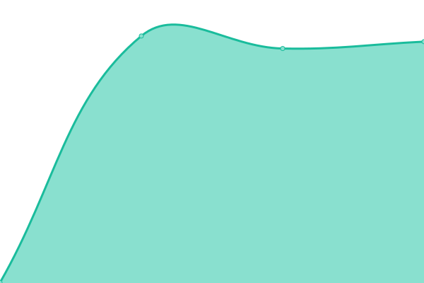
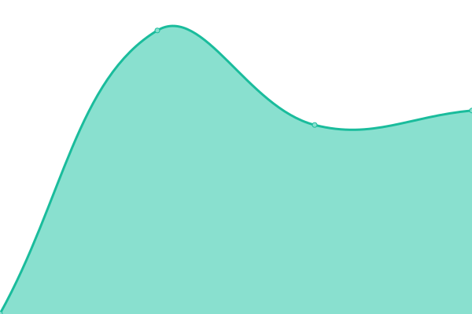

# [📈 Live Status](https://kphws.github.io/dheraldlang-service-status): <!--live status--> **🟩 All systems operational**

This repository contains the open-source uptime monitor and status page for [황와우](https://kphws.github.io/dheraldlang-service-status), powered by [Upptime](https://github.com/upptime/upptime).

With [Upptime](https://upptime.js.org), you can get your own unlimited and free uptime monitor and status page, powered entirely by a GitHub repository. We use [Issues](https://github.com/kphws/dheraldlang-service-status/issues) as incident reports, [Actions](https://github.com/kphws/dheraldlang-service-status/actions) as uptime monitors, and [Pages](https://kphws.github.io/dheraldlang-service-status) for the status page.

<!--start: status pages-->
<!-- This summary is generated by Upptime (https://github.com/upptime/upptime) -->
<!-- Do not edit this manually, your changes will be overwritten -->
<!-- prettier-ignore -->
| URL | Status | History | Response Time | Uptime |
| --- | ------ | ------- | ------------- | ------ |
|  [플립언어교육](https://dheraldlang.com/) | 🟩 Up | [.yml](https://github.com/kphws/dheraldlang-service-status/commits/HEAD/history/.yml) | 

 604ms
     
 | 

<a href="https://kphws.github.io/dheraldlang-service-status/history/">100.00%</a>
    

|  [DOGOnews](https://dogonews.co.kr/) | 🟩 Up | [dog-onews.yml](https://github.com/kphws/dheraldlang-service-status/commits/HEAD/history/dog-onews.yml) | 

 818ms
     
 | 

<a href="https://kphws.github.io/dheraldlang-service-status/history/dog-onews">100.00%</a>
    

|  [HERALDTEST](https://herald.stest.co.kr/) | 🟩 Up | [heraldtest.yml](https://github.com/kphws/dheraldlang-service-status/commits/HEAD/history/heraldtest.yml) | 

 611ms
     
 | 

<a href="https://kphws.github.io/dheraldlang-service-status/history/heraldtest">100.00%</a>
    

|  [Mock Test](https://stest.co.kr/) | 🟩 Up | [mock-test.yml](https://github.com/kphws/dheraldlang-service-status/commits/HEAD/history/mock-test.yml) | 

 903ms
     
 | 

<a href="https://kphws.github.io/dheraldlang-service-status/history/mock-test">100.00%</a>
    

<!--end: status pages-->

[**Visit our status website →**](https://kphws.github.io/dheraldlang-service-status)

## 📄 License

- Powered by: [Upptime](https://github.com/upptime/upptime)
- Code: [MIT](./LICENSE) © [황와우](https://kphws.github.io/dheraldlang-service-status)
- Data in the `./history` directory: [Open Database License](https://opendatacommons.org/licenses/odbl/1-0/)
